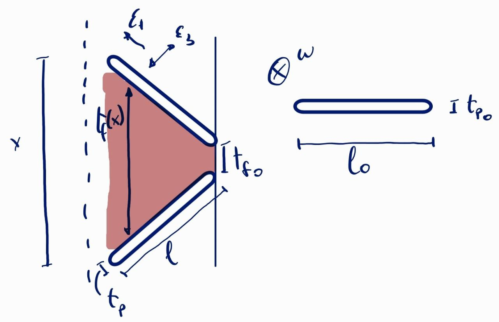
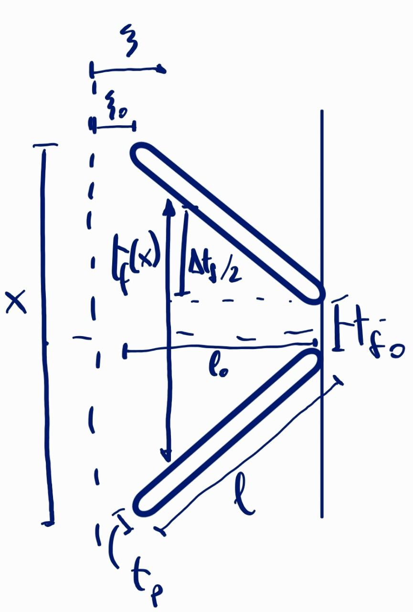

# 1 DOF Cell model

## Materials

### Kapton
* Young's modulus: $ Y_p = 2.5 \times 10^9$ GPa
* Poisson's ratio: $\nu = 0.34$
* Dielectric constant: $\epsilon_p = 3.4 * 8.854 \times 10^{-12}$ F/m
* Dielectric strength: $EBD_p = 200$ MV/m

###  XIAMETER™ PMX-200 Silicone Fluid 50 cSt
* Dielectric constant: $2.7 * 8.854 \times 10^{-12}$ F/m
* Dielectric strength: $EBD_F = 157.4 \times 10^3$ V/m

## Geometry
* Initial polymer thickness: $tp_0 = 25 \times 10^{-6} $ m
* Initial polymer length: $l_0 = 25 \times 10^{-3} $ m
* Residual fluid thickness: $tf_0 = 1 \times 10^{-6} $ m
* Half distance bewteen two consecutive capacitor cells: $\xi_0 = 3 \times 10^{-3} $ m

## Modelling
### Strains and lenghts
$$
\text{Longitudinal strain: } \epsilon_1 = \sqrt{1 + \left(\frac{x}{2 \,l_0}\right)^2} - 1 \\[5pt]
\text{Thickness strain: } \epsilon_3 = \epsilon_1 \frac{\nu}{\nu - 1} \\[5pt]
l = l_0 \left(1 + \epsilon_1\right) \\[5pt]
t_p = t_{p0} \left(1 + \epsilon_3\right) \\[5pt]
\sigma_1 = - Y_p \, \frac{\epsilon_1}{\nu^2 - 1} \\[5pt]
$$

	

$$
\left(\frac{x}{2} - \frac{tf_0}{2}\right) : l_0 = \frac{\Delta t_f}{2} : (l_0 - (\xi - \xi_0))
$$

### Capacitance
$$
dA = w * d\xi_{str} = w * (1 + \epsilon_1) * d\xi \\[5pt]
dC_p = \epsilon_p * \frac{dA}{t_p} \qquad
dC_f = \epsilon_f * \frac{dA}{t_f} \\[5pt]
dC = \left(\frac{2}{dC_p} + \frac{1}{dC_f}\right)^{-1} \\[5pt]
C = \int_{\xi_0}^{\xi_0 + l_0} \left(\frac{2}{dC_p} + \frac{1}{dC_f}\right)^{-1} d\xi \\[5pt]
$$
Minimum capacitance $\to$ maximum x

Maximum capacitance $\to$ minimum x

### Max Voltage
$$
V_{max}(x) = \frac{2 \, t_p}{\epsilon_p}  min( \epsilon_p \, EBD_p \, , \, \epsilon_f \, EBD_f) \\[5pt] 
$$

### Force
$$
U_{el} = 2 * \frac{1}{2} \, \sigma_1 \, \epsilon_1 \, w \, t_p \, l \\[5pt]
F(x,V) = \frac{dU_{el}}{dx} - \frac{V^2}{2}\frac{dC}{dx} \\[5pt]
